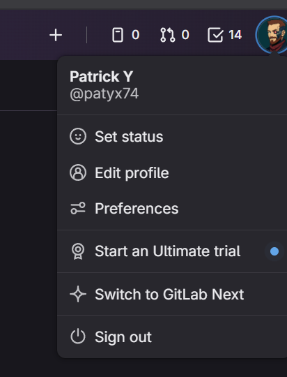

# Tools and Tips

This section describes useful tools and provides tips for working with them.

## GitLab Tips

### Add your profile photo

Adding an easily recognizable photo of yourself will help others quickly identify your profile. Many version control systems show profile images first and sometimes instead of profile names.

:::tip

If you are not comfortable posting a real photo of yourself, try using something unique and recognizable. Even an image of something like a hamburger :hamburger: is better than the default "image" &mdash especially if you use it consistently across platforms.

:::

### Configure your local user name/email

GitLab checks your account's user name against the user name attached to a given commit. If your account user name and commit user name do not match, the commit will be rejected by the remote repository.

To configure the correct `user.name`, run `git config --global user.name "YOUR_USER_NAME"`.

#### Finding your `user.name`

In the below image, you can see the `user.name` value listed as `Patrick Y`. Therefore, this user can set their locally configured `user.name` by running the command `git config --global user.name "Patrick Y"`.

- 

#### Why does Git require `user.name`?

Git is a distributed source control system. There is no single universal authority that can identify a user anywhere they can push a commit. The `user.name` and `user.email` properties are just strings definined in your Git configuration and a given commit. This allows Git to attribute commits to a user based on the `user.name` and `user.email` combination alone.

An alternative to `user.name` and `user.email` validation is GPG signing. Although requiring GPG signing on all commits is a best practice &mdash being more secure &mdash it is more difficult to implement by individual commiters. Beginners with Git are likely to become frustrated while setting up GPG signing, so without a simple turnkey option it is best to instead require `user.name` and `user.email` validation while encouraging adoption of GPG signing.

- [How to fix commits with an invalid `user.name` or `user.email`](./githelp.md#fix-commits-with-the-wrong-username)

### Set-up your notifications

Team members choose to manage their GitLab activities in different ways. Setup your notifications in a way that works best for you.

- **To-do list**: all GitLab users will see a [to-do list](https://docs.gitlab.com/ee/user/todos.html) within their GitLab account. This will track different action items. Items can be marked as done as they are completed.
- **Email**: team members can choose which, if any, notifications show up in their email inbox by using email filters.

## Handbook Tips

Refer to [the Handbook Development Guide](../about/develop/intro.md) to learn more about the architecture, structure, and how to edit this handbook locally on your desktop. For help editing this handbook in your brower, refer to [the Handbook Editing Guide](../about/editing.md).

## draw.io Tips

If you are using Visual Studio Code, install the [Draw.io Integration extension](https://marketplace.visualstudio.com/items?itemName=hediet.vscode-drawio) to integrate [draw.io](https://www.drawio.com/) into VS Code.

## Mermaid

[Mermaid](https://mermaid.js.org/) is a tool that allows you to create flowcharts, graphs, diagrams, Gantt charts, etc. For information about using Mermaid in Docusaurus, see [Docusaurus | Diagrams](https://docusaurus.io/docs/next/markdown-features/diagrams). For information about using Mermaid in GitLab, see the [examples in the GitLab docs](https://docs.gitlab.com/ee/user/markdown.html#mermaid).

A few additional resources that can be helpful when working with Mermaid are:

- The [live mermaid editor](https://mermaid-js.github.io/mermaid-live-editor) to check your work!
- A [CSS color bank](https://www.rapidtables.com/web/css/css-color.html) to add color to your charts.
- You can see an example of how to add images to Mermaid charts [here](https://mermaid-js.github.io/mermaid-live-editor/#/edit/eyJjb2RlIjoiZ3JhcGggVERcbiAgQVtDaHJpc3RtYXNdIC0tPnxHZXQgbW9uZXl8IEIoR28gc2hvcHBpbmcpXG4gIEIgLS0-IEN7TGV0IG1lIHRoaW5rfVxuICBDIC0tPnxPbmV8IERbTGFwdG9wXVxuICBDIC0tPnxUd298IEVbaVBob25lXVxuICBDIC0tPnxUaHJlZXwgRltmYTpmYS1jYXIgQ2FyXVxuICBDIC0tPiBHXG4gIEcoXCI8aW1nIHNyYz0naHR0cHM6Ly9pY29uc2NvdXQuY29tL21zLWljb24tMzEweDMxMC5wbmcnOyB3aWR0aD0nMzAnIC8-XCIpIiwibWVybWFpZCI6eyJ0aGVtZSI6ImRlZmF1bHQiLCJzZWN1cml0eUxldmVsIjoibG9vc2UifX0).
- [Advanced layout demos](./mermaid.mdx) for Mermaid diagrams

:::note

When creating Mermaid charts in this handbook, you need to type `three back tick symbols followed` by the word `mermaid` before the chart, and `three back tick symbols` at the end of the chart. This will enable Markdown to distinguish between `.md` and `Mermaid`. Please reference the example Mermaid charts linked above to see how this looks live.

:::

## Git

- Use [`git-drop-gone`](https://gist.github.com/paddy74/0264fe38120261edafe559ee1e0ff030) to remove all local branches that are not on remote.
- Use [`git-clean`](https://gist.github.com/paddy74/8e98221210aea2156b01a988cc497599) to remove ignored files from the current git repository.

### Git Config

Configure your global `.gitconfig` by running the following commands:

```bash
git config --global color.ui auto
git config --global http.postBuffer 157286400
git config --global init.defaultBranch main
git config --global fetch.prune true
```

### Shell aliases

Use command aliases in your shell to speed up your workflow. Take a look at [these aliases](https://gitlab.com/sytses/dotfiles/blob/master/zsh/aliases.zsh) and others in [Sid's dotfiles project](https://gitlab.com/sytses/dotfiles/tree/master). For example, by adding the following to your `.bash_profile` or equivalent for your shell, you can just type `s` to checkout the `main` branch of this website, pull the latest changes, and open the repository in Sublime Text:

```bash
alias gco='git checkout'
alias gl='git pull --prune'
alias gca='git commit -a'
alias gp='git push origin HEAD'
alias www='cd ~/Workspace/Repos/idas-handbook'
alias s='www;subl .;gco master;gl'
```

After editing, you can just type `gca` to commit all of your changes, followed by `gp` to push them to the remote branch.

If you are using [Oh My ZSH!](https://ohmyz.sh/), you can add custom aliases shown below. You can freely define the file name, only the suffix `.zsh` is important.

```bash
vim ~/.oh-my-zsh/custom/aliases.zsh
```

An example can be found in [Michael Friedrich's dotfiles project](https://gitlab.com/dnsmichi/dotfiles/-/tree/main/.oh-my-zsh/custom).

## Dotfiles

You can use dotfiles to customize your system, and keep all configuration in a central place. The name `dot file` is derived from Linux/Unix where all configuration files started with a dot, hiding them from the default list view `ls`.

Example dotfiles projects:

- [Sid Sijbrandij's dotfiles](https://gitlab.com/sytses/dotfiles)
- [Michael Friedrich's dotfiles](https://gitlab.com/dnsmichi/dotfiles), more details in [this blog post](https://about.gitlab.com/blog/2020/04/17/dotfiles-document-and-automate-your-macbook-setup/)
- [Brendan O'Leary's dotfiles](https://gitlab.com/brendan/dotfiles)

## Python

- If pip is your Python package manager, use [pip-upgrade](https://gist.github.com/paddy74/d6923e92100d7c986fbc5abf1b9c2d73) to updgrade all Python packages in your active Python environment.
