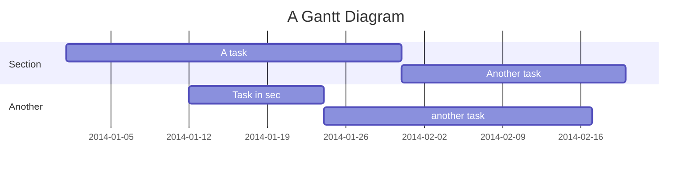
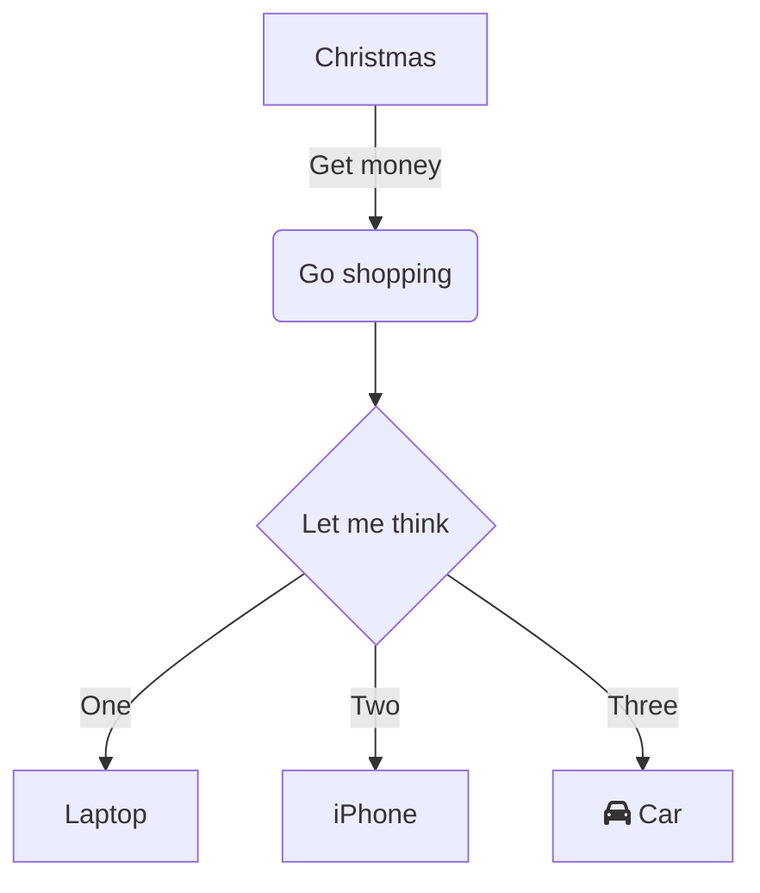
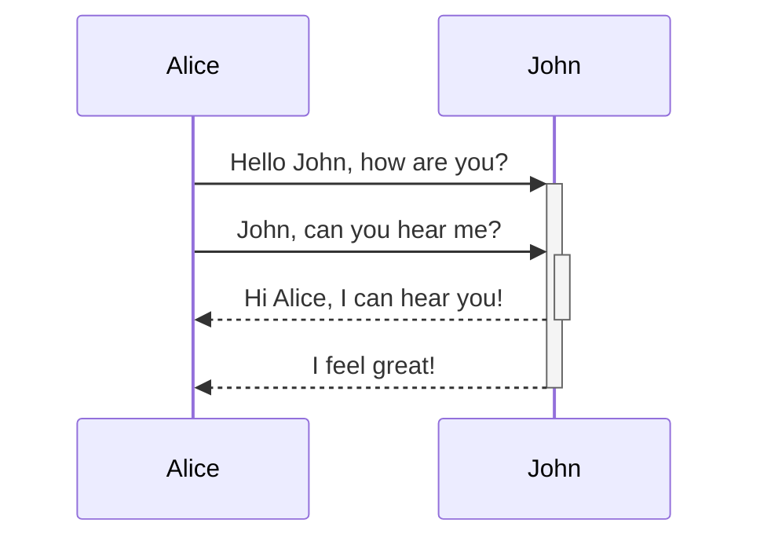

# Mermaid Layouts

This article is intended to help with some advanced layout options for Mermaid diagrams. For this handbook's main Mermaid documentation, please refer to the [Tools and Tips page](./index.md#mermaid).

## Gantt

<details>
<summary markdown="span">Code</summary>

```md
gantt title A Gantt Diagram dateFormat YYYY-MM-DD section Section A task :a1, 2014-01-01, 30d Another task :after a1 , 20d section Another Task in sec :2014-01-12 , 12d another task : 24d
```

</details>



## Flowchart (centered)

<details>
<summary markdown="span">Code</summary>

```md
graph TD A[Christmas] -->|Get money| B(Go shopping) B --> C{Let me think} C -->|One| D[Laptop] C -->|Two| E[iPhone] C -->|Three| F[fa:fa-car Car]
```

</details>



## Sequence Diagram (right aligned)

<details>
<summary markdown="span">Code</summary>

```md
sequenceDiagram Alice->>+John: Hello John, how are you? Alice->>+John: John, can you hear me? John-->>-Alice: Hi Alice, I can hear you! John-->>-Alice: I feel great!
```

</details>



## Gantt (wide scrollable)

<details>
<summary markdown="span">Code</summary>

```md
gantt title A Gantt Diagram dateFormat YYYY-MM-DD section Section A task :a1, 2014-01-01, 30d Another task :after a1 , 20d section Another Task in sec :2014-01-12 , 12d another task : 24d
```

</details>


