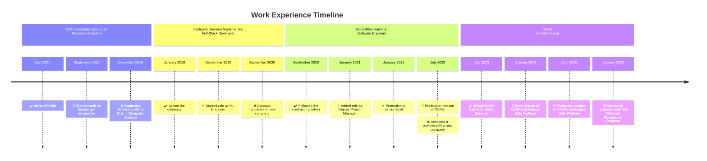

# Work Experience

---

## NASA

- National Aeronautics and Space Administration (NASA)
- July 2023 &ndash; Jan 2025
- Hampton, VA (NASA Langely)

As the Technical Lead of NASA Data & Analytics Services, I led the architecture, implementation, and adoption of NASA's enterprise data platforms to drive Agency-wide data modernization, data governance, scalable data analytics, and AI development in business- and mission-critical environments.

[:right_arrow: Learn More](./xp/nasa.md)

## Booz Allen Hamilton

- Booz Allen Hamilton
- Sept 2020 &ndash; July 2023
- Fort Eustis, Hampton, VA

As a Senior Software Engineer and Deputy Project Manager supporting Army T2COM G2, I developed full-stack data management, discovery, analytics, and visualization systems and threat-actor network analysis tools, accelerating the creation of training and doctrine research publications.

[:right_arrow: Learn More](./xp/boozallen.md)

## Intelligent Decision Systems, Inc

- Intelligent Decision Systems, Inc.
- Jan 2019 &ndash; Sept 2020
- Newport News, VA

As a Full-Stack Developer and Machine Learning Engineer, I developed full-stack data discovery applications and text analytics models for T2COM G2's Publication Management Platform, improving search relevance, data trust, and analyst productivity across research and publication workflows.

[:right_arrow: Learn More](./xp/idsi.md)

## Research Assistant

- [Old Dominion University Research Foundation](https://www.odu.edu/odu-research-foundation)
- April 2017 &ndash; Dec 2018
- Norfolk, VA

As an Undergraduate Research Assistant with Old Dominion University's Computer Vision Lab, I contributed to NIH-funded biomedical imaging research and Army-funded security analytics by developing deep-learning models, computer-vision pipelines, and LiDAR-based behavior-recognition systems.

[:right_arrow: Learn More](./xp/oduvisionlab.md)
